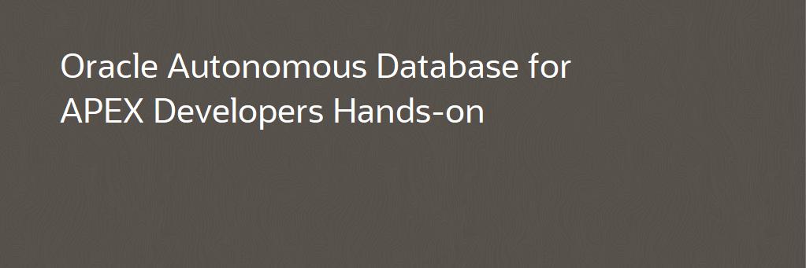

# Autonomous Database for APEX Developers - Part I and II #

## Introduction ##

This project contains the links for the lab materials for the Autonomous Database for Apex Developers workshop. 
They are split into two parts as it usually delivered in two sessions.

## Lab Materials ##

- Lab scripts Zip file. This zip file holds all the scripts referenced in both parts of the lab.
- Part 1. Lab 100, 200 & 300: First steps with ATP, Add Spatial to your APEX app & Add Machine Learning to your APEX app 
- Part 2. Lab 400 & 500: Add Security to your APEX app & Add Analytics to your APEX app 

## [License](LICENSE)
Copyright (c) 2020 Oracle and/or its affiliates
The Universal Permissive License (UPL), Version 1.0
